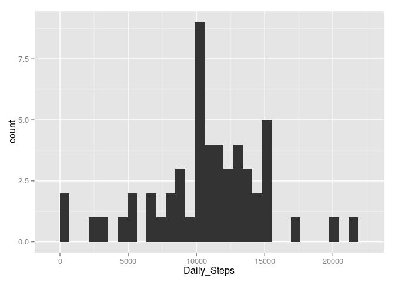
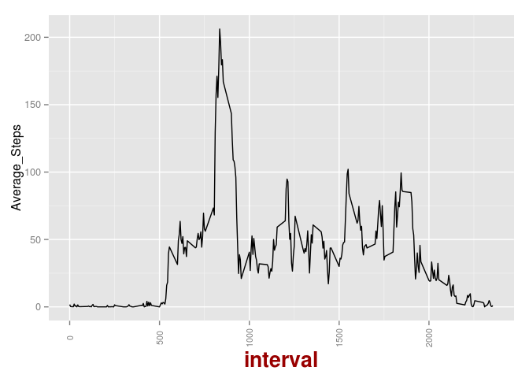
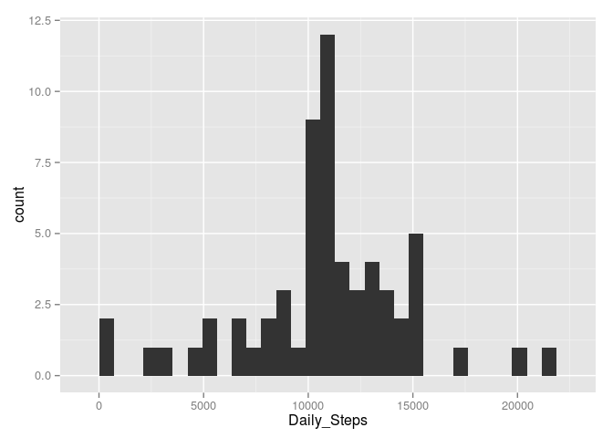
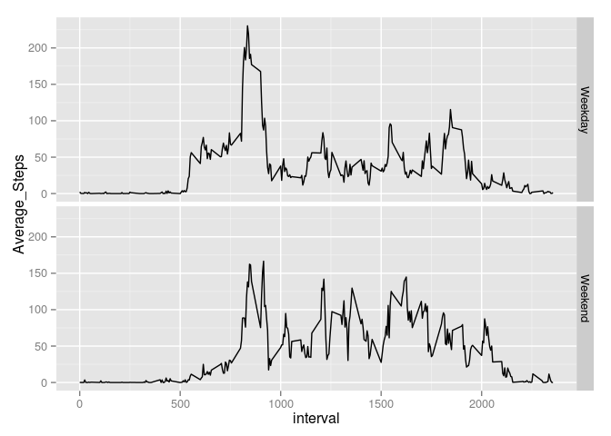

# Reproducible Research: Peer Assessment 1


## Loading and preprocessing the data
We begin in a working directory that contains the activity file and read in the contents of the file. 


```r
setwd("~/Desktop/R Data/RepData_PeerAssessment1")

dat <- read.csv("activity.csv")
```

Take a peek at the contents of dat.

```r
head(dat)
```

```
##   steps       date interval
## 1    NA 2012-10-01        0
## 2    NA 2012-10-01        5
## 3    NA 2012-10-01       10
## 4    NA 2012-10-01       15
## 5    NA 2012-10-01       20
## 6    NA 2012-10-01       25
```

```r
tail(dat)
```

```
##       steps       date interval
## 17563    NA 2012-11-30     2330
## 17564    NA 2012-11-30     2335
## 17565    NA 2012-11-30     2340
## 17566    NA 2012-11-30     2345
## 17567    NA 2012-11-30     2350
## 17568    NA 2012-11-30     2355
```

```r
str(dat)
```

```
## 'data.frame':	17568 obs. of  3 variables:
##  $ steps   : int  NA NA NA NA NA NA NA NA NA NA ...
##  $ date    : Factor w/ 61 levels "2012-10-01","2012-10-02",..: 1 1 1 1 1 1 1 1 1 1 ...
##  $ interval: int  0 5 10 15 20 25 30 35 40 45 ...
```

The activity CSV contains a number of steps during a given five-minute period. For each date, the interval variable is the beginning of the five-minute portion of the day (in military time). 
## What is mean total number of steps taken per day?
To begin, we have to find the mean sum of day's steps.

```r
library(dplyr)
```

```
## 
## Attaching package: 'dplyr'
```

```
## The following objects are masked from 'package:stats':
## 
##     filter, lag
```

```
## The following objects are masked from 'package:base':
## 
##     intersect, setdiff, setequal, union
```

```r
library(ggplot2)
dat1 <- dat %>% group_by(date) %>% summarize(Daily_Steps=sum(steps))
dat1
```

```
## Source: local data frame [61 x 2]
## 
##          date Daily_Steps
##        (fctr)       (int)
## 1  2012-10-01          NA
## 2  2012-10-02         126
## 3  2012-10-03       11352
## 4  2012-10-04       12116
## 5  2012-10-05       13294
## 6  2012-10-06       15420
## 7  2012-10-07       11015
## 8  2012-10-08          NA
## 9  2012-10-09       12811
## 10 2012-10-10        9900
## ..        ...         ...
```

```r
g <- ggplot(data=dat1, aes(x= Daily_Steps))+
        geom_histogram()
print(g)
```

```
## stat_bin: binwidth defaulted to range/30. Use 'binwidth = x' to adjust this.
```



From here, it's simple to find the average and median of all the days.


```r
mean(dat1$Daily_Steps, na.rm=TRUE) #na.rm=TRUE is important or else this will return NA
```

```
## [1] 10766.19
```

```r
median(dat1$Daily_Steps, na.rm=TRUE)
```

```
## [1] 10765
```

## What is the average daily activity pattern?
Finding the daily activity pattern means we have to start back at dat and summarize the steps by interval.

```r
library(ggplot2)
library(dplyr)
dat2 <- dat %>% group_by(interval) %>% summarize("Average_Steps" = mean(steps, na.rm=TRUE))

dat2
```

```
## Source: local data frame [288 x 2]
## 
##    interval Average_Steps
##       (int)         (dbl)
## 1         0     1.7169811
## 2         5     0.3396226
## 3        10     0.1320755
## 4        15     0.1509434
## 5        20     0.0754717
## 6        25     2.0943396
## 7        30     0.5283019
## 8        35     0.8679245
## 9        40     0.0000000
## 10       45     1.4716981
## ..      ...           ...
```

```r
g <- ggplot(data=dat2, aes(x= interval, y= Average_Steps)) +
        geom_line() +
        theme(axis.title.x = element_text(face="bold", colour="#990000", size=20),
           axis.text.x  = element_text(angle=90, vjust=0.5, size=8))

print(g)
```



Finding the interval that typically has the highest number of steps may also be useful, which is easily accomplished in a dplyr pipeline.


```r
#finding the interval with the highest average number of steps.
dat2 %>% filter(Average_Steps == max(Average_Steps)) %>% select(interval)
```

```
## Source: local data frame [1 x 1]
## 
##   interval
##      (int)
## 1      835
```


## Imputing missing values
This dataset contains a fair number of NA or missing values, which we may want to replace with a rough estimate.


```r
#How many rows have NA values?
nrow(dat %>% filter(!complete.cases(dat)))
```

```
## [1] 2304
```

Imputing the missing values could be handled a number of ways. Since the assignment said something simple was acceptable, I will use the mean for the five-minute interval. Recall that I have already calculated the interval mean in `dat2$Average_Steps`.


```r
#Mutate the average steps with ifelse()
dat3 <- dat %>% mutate(steps = ifelse(is.na(steps),                           dat2$Average_Steps[match(interval, dat2$interval)], steps))

#Check that we got rid of the NA values
nrow(dat3 %>% filter(!complete.cases(dat3)))
```

```
## [1] 0
```

Has this significantly impacted the overview of the stats?

```r
#g is the same histogram from before
g <- ggplot(data=dat1, aes(x= Daily_Steps))+
        geom_histogram()

#prepare and create a new histogram from imputed data for comparison
dat4 <- dat3 %>% group_by(date) %>% summarize(Daily_Steps = sum(steps))
h <- ggplot(data=dat4, aes(x= Daily_Steps))+
        geom_histogram()

print(g)
```

```
## stat_bin: binwidth defaulted to range/30. Use 'binwidth = x' to adjust this.
```


```r
print(h)
```

```
## stat_bin: binwidth defaulted to range/30. Use 'binwidth = x' to adjust this.
```



```r
mean(dat4$Daily_Steps, na.rm=TRUE)
```

```
## [1] 10766.19
```

```r
median(dat4$Daily_Steps, na.rm=TRUE)
```

```
## [1] 10766.19
```

## Are there differences in activity patterns between weekdays and weekends?
One might wonder what the differences in activity are between weekdays and weekends. Using weekdays() we can find the weekday of each date, and then separate weekdays and weekends.


```r
dat5 <- dat3 %>% mutate(date = as.Date(date),Weekday= weekdays(date, abbreviate=FALSE), Weekend = ifelse(Weekday %in% c("Saturday","Sunday"),"Weekend","Weekday"))

#head(dat5)
#unique(dat5)

dat5 <- dat5 %>% group_by(Weekend, interval) %>% summarize(Average_Steps = mean(steps))
g <- ggplot(data= dat5, aes(x=interval, y=Average_Steps))

g <- g+ geom_line() + facet_grid(Weekend ~ .)

print(g)
```


